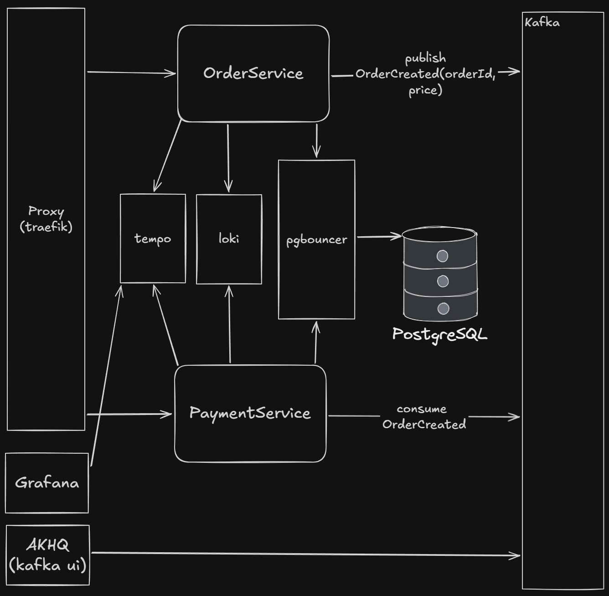

# Description
This repo shows an example of transactional outbox pattern.
Each branch from 1 to 8 contains an improved implementation where bugs are fixed or optimization is improved.

# Branches 
1. **main** - without transactional outbox pattern, save to the database and fire&forget messages.
2. **outbox-basic-implementation-1** - basic implementation of the pattern.
3. **outbox-with-idempotency-2** - added deduplication on the consumer side.
4. **outbox-multiple-instances-3** - prepared config to run multiple instances.
5. **outbox-with-locking-4** - locking rows to prevent taking the same row at one time.
6. **outbox-with-batching-5** - selecting multiple rows to process at one time. 
7. **outbox-with-heardbeat-6** - preventing rows from getting stuck in the processing state.
8. **outbox-with-retries-7** - advanced retries with exponential backoff strategy.
9. **outbox-with-cleaning-worker-8** - cleaning the database from long processed messages.

# Architecture


# Requirements
**1. .NET 10**  
**2. Docker**   
**3. docker compose**  
**4. make**  
**5. k6**  
**6. Commands below are adapted only for windows**

# Anomalies reproduction

### Loosing messages
1. `git checkout main`
2. `docker compose up --build -d`
3. `k6 run tests/testcase_1.js`
4. Wait 10 seconds.
5. Run a couple of times: `docker pause orders-kafka; Start-Sleep 10; docker restart orders-api; docker unpause orders-kafka`
6. When the k6 script has ended and the lag is 0 in akhq:
   ```
   SELECT 'orders' as name, COUNT(*) AS count, SUM(price) AS money FROM orders.orders
   UNION ALL
   SELECT 'payments' as name, COUNT(*) AS count, SUM(amount) AS money FROM payment.payments;
   ```

**Result**: orders.money > payments.money, some of messages are lost.

### Duplicating messages
1. `git checkout outbox-basic-implementation-1`
2. `docker compose up --build -d`
3. `k6 run tests/testcase_1.js`
4. Wait 10 seconds.
5. Run a couple of times: `docker pause orders-kafka; Start-Sleep 10; docker restart orders-api; docker unpause orders-kafka`
6. When the k6 script has ended and the lag is 0 in akhq:
   ```
   SELECT 'orders' as name, COUNT(*) AS count, SUM(price) AS money FROM orders.orders
   UNION ALL
   SELECT 'payments' as name, COUNT(*) AS count, SUM(amount) AS money FROM payment.payments;
   ```
7. ```
   SELECT order_id FROM payment.payments
   GROUP BY order_id
   HAVING COUNT(order_id) > 1;
   ```

**Result**: orders.money < payments.money, some of the messages have duplicates in the payment service.

### Several instances process the same message at one time
1. `git checkout outbox-multiple-instances-3`
2. `make up`
3. `k6 run tests/testcase_1.js`
4. Go to grafana on localhost:3000, credentials - admin/admin.
5. Explore → select "Loki" and builder → Label filers: "app=order service"
6. Find any order id → + Operations → Line filter → Line contains → paste the order id  

**Result**: many logs records with different instance ids at one time.

### Messages get stuck in the Processing status
1. `git checkout outbox-with-batching-5`
2. `make up`
3. `k6 run tests/testcase_1.js`
4. Wait 10 seconds.
5. Run a couple of times: `docker restart -t 0 outbox-example-orders-api-1; docker restart -t 0 outbox-example-orders-api-2`
6. When the k6 script has ended and the lag is 0 in akhq:
   ```
   SELECT COUNT(id) FROM orders.outbox_messages WHERE status = 'Processing';
   ```
**Result**: the count > 0, because some of the instances went down while processing the messages and those records will never be processed.

### The increasing amount of the rows in the outbox table slows down the `POST:/api/orders` calls
1. `git checkout outbox-with-retries-7`
2. `make up`
3. `k6 run tests/testcase_1.js`
4. Wait until the k6 script has ended and the lag is 0 in akhq.
5. Go to the grafana → Dashboards → API Performance
6. Compare the average request execution time in the first half of the chart and the second half.  

**Result**: The average request execution time has grown twice at the end.